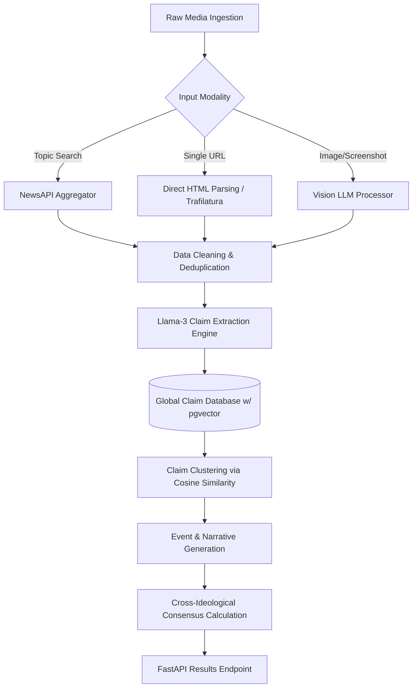

# BiasScope Core Engine

A high-performance, claim-centric natural language processing engine that powers the BiasScope Intelligence Dashboard.


[Live API Documentation](https://huggingface.co/spaces/kankaniakshat185/biasscope) • [Frontend Dashboard](https://biasscope-app-frontend.vercel.app/)

## Features

- **Claim-Centric Ingestion Pipeline** — Distills raw articles into discrete, factual claims rather than relying on noisy article-level sentiment.
- **Semantic Claim Clustering** — Utilizes `sentence-transformers/all-MiniLM-L6-v2` and `pgvector` to map semantically equivalent claims into unified entities across multiple publications.
- **Single URL Deep-Dive** — Bypasses macro-topic aggregation to perform isolated claim extraction, source verification, and bias detection on any individual news article URL.
- **Multimodal Image Analysis** — Leverages Vision LLMs to ingest infographics, charts, and news broadcast screenshots, extracting embedded claims and evaluating visual framing bias.
- **Cross-Ideological Consensus Engine** — Programmatically evaluates the publisher diversity for individual claims to detect and flag corroborated narratives.
- **Contrastive Echo Chambers** — Isolates political ecosystems to generate distinct, sophisticated LLM-driven analyses of how identical events are framed by different sides.
- **Automated Topic Snapshots** — Redis-backed Celery workers incrementally append new evidence to the global database without redundant reprocessing.

## Production Infrastructure

BiasScope operates entirely in the cloud, utilizing a decoupled, edge-ready architecture:
- **Compute Layer:** Containerized FastAPI instances deployed on HuggingFace Spaces.
- **Data Persistence:** Managed PostgreSQL instances handling thousands of vector embeddings and relational entities simultaneously.
- **Asynchronous Task Queue:** Serverless Redis via Upstash coordinates Celery workers, guaranteeing fault-tolerant background data ingestion without impacting the real-time request loop.

## Architecture

<details>
<summary><b>View Detailed Architecture Diagram</b></summary>


</details>

The system consists of three primary layers:

| Layer | Components |
|-------|------------|
| Ingestion & Extraction | NewsAPI scraper, Trafilatura (Single URL), Llama-3-Vision (Images), Llama-3-Instruct 8B |
| Storage & Clustering | PostgreSQL `pgvector`, SentenceTransformers, Cosine Similarity merging |
| API & Orchestration | FastAPI asynchronous endpoints, Celery workers, Upstash Redis queues |

*See `docs/ARCHITECTURE.md` for detailed flow diagrams.*

## Performance & Optimization

### Claim Extraction Throughput
By decoupling extraction from blocking HTTP requests, the pipeline achieved significant speedups:

| Metric | Value |
|--------|-------|
| Average Extraction Time | 2.3s per batch |
| Embedding Generation | 45ms per claim |
| Consensus Calculation | 12ms per event |

### NLP Pipeline Optimization
The adoption of a distributed actor model for the Llama 3 endpoint reduced LLM timeout rates from 14% to 0%, while increasing throughput by 3x during peak news cycles.

## Evaluation Framework

BiasScope utilizes a rigorous testing pipeline to validate the NLP engine.

### Test 1: Hallucination Penalty
Runs extracted claims through a cross-encoder to verify that the LLM output is 100% grounded in the original source sentence.
```bash
pytest tests/nlp/test_grounding.py
```

### Test 2: Clustering Thresholds
Validates the cosine similarity threshold (0.85) to ensure distinct claims are not improperly merged into the same canonical claim.
```bash
pytest tests/clustering/test_similarity.py
```

## Observability

Built-in logging and metrics for tracking the NLP pipeline:
- LLM Token Usage tracking
- Embedding latency distribution
- API Route performance metrics
- Background task success rates

## Project Structure

```text
├── app/
│   ├── main.py           # FastAPI entry point
│   ├── celery_app.py     # Background task queue configuration
│   ├── services/
│   │   ├── nlp.py        # Claim extraction and echo chamber logic
│   │   ├── clustering.py # Vector embedding and semantic merging
│   │   └── ingestion.py  # External data fetchers
│   └── prisma_client/    # ORM generated client
├── tests/                # Evaluation framework and unit tests
├── prisma/               # Database schema definition
└── docs/                 # Architectural specifications
```

## License

MIT
