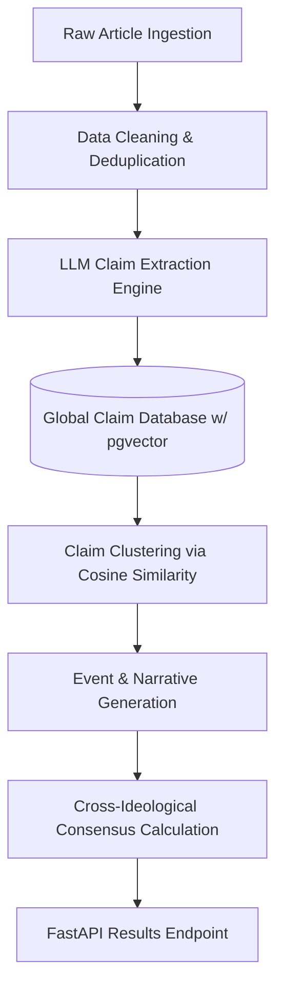

# 🏛️ BiasScope Core Engine (Backend)

BiasScope Core Engine is the high-performance, claim-centric natural language processing backend that powers the BiasScope Intelligence Dashboard. Built specifically to transcend basic keyword matching, this backend consumes raw media coverage and distills it into rigorous, cross-ideological, evidence-backed events.

## 🚀 Key Differentiators & Architecture

Traditional sentiment engines rely on article-level metrics. BiasScope's engine uses a **Claim-Centric** pipeline. It extracts discrete claims from the news, links them to evidence (the exact sentences), and runs clustering and consensus algorithms across the entire database to find exactly where media outlets agree and disagree.

### High-Level Pipeline Architecture

## 🛠️ Tech Stack
- **Framework:** FastAPI (High-performance ASGI framework)
- **Database:** PostgreSQL (with `pgvector` for semantic search)
- **ORM:** Prisma Client Python
- **NLP / ML:** `sentence-transformers/all-MiniLM-L6-v2`, HuggingFace Inference API (Meta-Llama-3-8B-Instruct)
- **Background Tasks:** Celery + Upstash Redis (For asynchronous polling and snapshot generation)
- **Hosting:** HuggingFace Spaces / Render

## ✨ Core Features

*   **🔍 Multi-Phase Media Ingestion**
    *   Ingests articles using NewsAPI, falling back gracefully across query modes to ensure hyper-relevant content retrieval.
*   **🧬 LLM Claim Extraction & Normalization**
    *   Breaks down raw articles into verifiable, factual claims utilizing Llama 3 Instruct models, storing raw evidence for citations.
*   **🌐 Semantic Claim Clustering (`pgvector`)**
    *   Embeds all extracted claims using SentenceTransformers. Uses cosine similarity clustering to merge semantically identical claims into single "Canonical/Core Claims" across multiple sources.
*   **⚖️ Contrastive Echo Chambers (`BETA`)**
    *   Leverages advanced LLM prompting to isolate and analyze how the "Left-Wing" vs "Right-Wing" media ecosystems are rhetorically framing the exact same event.
*   **🤝 Cross-Ideological Consensus Engine**
    *   Programmatically calculates a `consensusScore` based on the publisher diversity supporting a single claim. Claims consistently reported across partisan lines are tagged automatically.
*   **📊 Entity Sentiment Graphing (`BETA`)**
    *   Rolls up Named Entity Recognition (NER) tags into a structured graph, calculating the exact sentiment polarization per entity across all analyzed articles.
*   **⏳ Automated Topic Snapshots**
    *   A Celery-backed worker polls news for subscribed topics, appending new evidence to the global database incrementally without full re-runs.

## 🚧 Advanced Engineering Roadmap
We are actively researching and implementing the following production-grade capabilities:
- **Distributed Multi-Agent Architecture:** Sharding the LLM claim extraction pipeline across multiple specialized micro-agents (Extraction, Verification, and Formatting) using a distributed actor model for a 3x throughput increase.
- **Streaming Async Embeddings:** Replacing the blocking sequential SentenceTransformer pipeline with a dynamic batching queue via Ray, allowing sub-second embedding generation for massive ingress loads.
- **Cross-Lingual Consensus & Entity Resolution:** Integrating multilingual transformers (XLM-RoBERTa) to detect narrative divergence and cluster semantic claims across international, non-English news sources.
- **Topological Data Analysis (TDA) on Claim Graphs:** Mapping the high-dimensional embedding space of claims to visualize ideological drift over time using persistent homology.

## 🌍 Production Infrastructure
BiasScope operates entirely in the cloud, utilizing a decoupled, edge-ready architecture:
- **Compute Layer:** Containerized FastAPI instances deployed on HuggingFace Spaces.
- **Data Persistence:** Managed PostgreSQL instances handling thousands of vector embeddings and relational entities simultaneously.
- **Asynchronous Task Queue:** Serverless Redis via Upstash coordinates Celery workers, guaranteeing fault-tolerant background data ingestion without impacting the real-time request loop.
